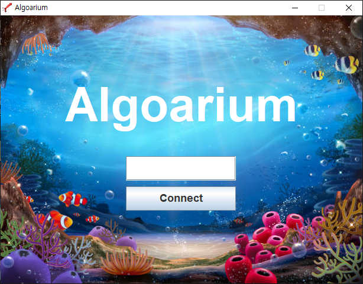
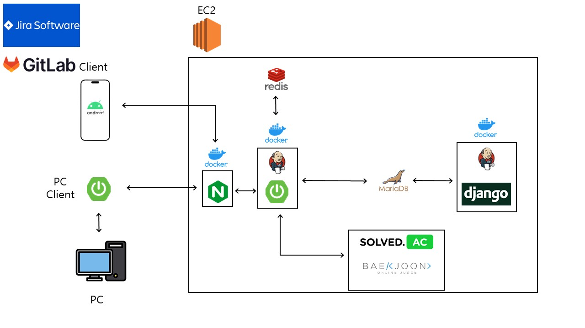

# 🧳 알고알리움

{: width="150" height="300"}

## == Contents ==

1. [개요](#1-개요)
2. [프로젝트 소개](#2-프로젝트-소개)
3. [주요 기능](#3-주요-기능)
4. [프로젝트 실행방법](#4-프로젝트-실행-방법)
5. [기술스택](#5-기술-스택)
6. [프로젝트 구조도](#6-프로젝트-구조도)
7. [Design](#7-design)
8. [Team](#8-team)

<br>
<br>

## 1. 개요

- 개발 기간: 2023.10.05 ~ 2023.10.05

- 삼성 청년 소프트웨어 아카데미(SSAFY) 빅데이터 추천 프로젝트
  
  `#빅데이터` `#백준 알고리즘문제 추천`

<br>
<br>

## 2. 프로젝트 소개

🌊 알고알리움 : '알고리즘문제를 알려준다' + '아쿠아리움'

- 알고리즘 문제를 사용자에 실력에 맞추어 (강점 문제, 약점 문제, 비슷한 사용자가 푼 문제)로 나누어 알고리즘 문제를 추천해주는 빅데이터 기반 추천 프로젝트

<br>

> 강점 문제란?

- 사용자의 능력에 비해 많이 푼 유형의 문제로, 능력 대비 어려운 문제를 추천

> 약점 문제란?

- 사용자의 능력에 비해 적게 푼 유형의 문제로, 능력 대비 쉬운 문제를 추천

> 비슷한 사용자가 푼 문제란?

- 사용자의 능력과 비슷한 다른 사용자들이 많이 푼 문제를 추천

<br>
<br>

## 3. 주요 기능

### 3.1. 시즌 별 티어 제도

{: width="150" height="300"}

- 8단계의 티어를 두어 시즌 내 특정 포인트 달성 시 승급
- 매 시즌 포인트 초기화
- 이전 시즌 티어는 상징으로 기록됨

<br>

### 3.2. 랭킹 제도

{: width="150" height="300"}

- 포인트를 기반으로 전체 사용자의 랭킹을 보여줌

<br>

### 3.3. 스탯 제도

{: width="150" height="300"}

- 사용자에게 5개의 스탯 (지혜, 생명, 힘, 운, 카리스마)을 할당
- 지혜 : 푼 문제 수
- 생명 : 최대 연속 문제풀이 횟수
- 힘 : rating 변화
- 운 : solved.ac의 별조각 갯수
- 카리스마 : 정답자 수가 낮은 문제를 맞춘 횟수

<br>

### 3.4 알고리즘 문제 추천

{: width="150" height="300"}

- 알고리즘 문제를 사용자에 실력에 맞추어 (강점 문제, 약점 문제, 비슷한 사용자가 푼 문제)로 나누어 알고리즘 문제를 추천

- 해당 문제를 찜할 수 있고 메모 가능

<br>

### 3.5 모바일 - PC 연동

{: width="350" height="300"}

- PC 어플리케이션을 실행하고 모바일과 연동 한 후 모바일 환경에서 문제를 클릭하면 해당 PC에 백준 문제페이지를 띄움
- 어플리케이션은 백그라운드에서도 실행 가능

<br>
<br>

## 4. 프로젝트 실행 방법

### 4.1. client 실행

1. **PC클라이언트 다운로드**

```bash
$ http://j9d204.p.ssafy.io:8090/
```

2. **모바일에서 인증코드 확인 후 연동**

<br>

### 4.2. server 실행

1. **원격 저장소 복제(git clone)**

```bash
$ https://lab.ssafy.com/s09-bigdata-recom-sub2/S09P22D204.git
```

2. **프로젝트 폴더로 이동**

```bash
$ cd BE/algoarium
```

3. **main 메서드 실행하기**

<br>
<br>

## 5. 기술 스택

### 5.1. Back-End

- **Spring boot** : 알고알리움 Project의 전반적인 Rest Controller 구현.
- **JPA (Hibernate)** : ORM인 Hibernate를 활용하여 객체 중심의 개발을 할 수 있도록 하였고, SQL을 직접 작성하지 않고 Entity 필드가 되는 객체를 통해 DB를 동작시켜 유지보수에 용이하게 활용.
  - 동일한 쿼리에 대한 캐시 기능을 사용하기 때문에 높은 효율성 기대.
- **Django** : 빅데이터 추천 알고리즘 기능 구현.
- **MariaDB** : RDBMS로 알고알리움의 사용자, 문제 정보 등 필요한 데이터를 저장.
- **Redis** : 비관계형 데이터베이스로 'Key-Value' 구조 데이터 관리 시스템이며, 데이터를 메모리에 저장하여 빠른 처리속도가 필요한 기능에 적용.
  - 만료일을 저장하면 만료 시 자동으로 데이터가 사라지는 특성을 활용하여 카카오톡 인증 토큰을 저장하여 로그인에 활용.
- **AWS** : EC2 서비스를 이용하여 Ubuntu 서버를 구축 (호스팅).
- **Nginx** : 웹 서버를 구축
  - default.conf를 수정하여 EC2에 저장된 파일 경로를 참조할 수 있게 활용.
- **WebSocket** : 웹 상에서 쉽게 소켓 통신을 하게 해주는 라이브러리를 활용하여 모바일-PC로 알고리즘 URL 정보를 전달해주는 기능을 구현.
- **STOMP** : Http에 모델링된 frame 기반의 메세징 프로토콜을 통해 메세지 전송을 좀 더 효율적으로 하기 위해 활용.
  - `STOMP Hanler`를 구현하여 Subscribe를 통해 통신하고자 하는 주체(Topic)를 판단하여 실시간, 지속적으로 감시하고 해당 요청이 들어오면 처리하도록 구현. (Broker 역할 수행)

### 5.2. Front-End

- **Android Studio** : 알고알리움 Project의 mobile 어플리케이션 구현.
- **Kakao API** : 카카오 인증 토큰을 주고 받아 로그인 기능 구현.

### 5.3. TEAM Cooperaion

- **GitLab**: GitLab을 활용하여 프로젝트를 관리.
  - Git Flow 에 따른 브랜치 전략 수립.
  - MR 시 코드 리뷰 진행.
- **Jira**: 이슈 관리 도구로 활용.
  - 주요 기능들을 이슈로 등록하고 Stroy Point를 산정한 후, 담당자를 지정하여 프로젝트를 진행.
  - 1~2 주 정도 상황에 맞게 스프린트를 설정.
- **Google Drive** : 협업을 위한 공용 문서 및 산출물들을 공유할 수 있도록 활용.
  - 동시 문서 작성 (Google Docs).
  - 대용량 파일 첨부.
- **Notion**
  - 일정 관리 및 트러블 슈팅 메모.
  - 세션을 통해 새로운 지식 공유.

<br>
<br>

## 6. 프로젝트 구조도

```
└─📂backend
    └─📁 algo_MR
    └─📁 algoarium
    └─📁 socket
└─📂frontend
```

<details>
<summary>Front-End</summary>
<div markdown="1">

```
─app
│  └─src
│      ├─androidTest
│      │  └─java
│      │      └─com
│      │          └─d204
│      │              └─algo
│      ├─main
│      │  ├─java
│      │  │  └─com
│      │  │      └─d204
│      │  │          └─algo
│      │  │              ├─base
│      │  │              ├─cache
│      │  │              │  ├─dao
│      │  │              │  ├─mapper
│      │  │              │  └─model
│      │  │              ├─data
│      │  │              │  ├─api
│      │  │              │  ├─model
│      │  │              │  ├─repository
│      │  │              │  │  ├─cache
│      │  │              │  │  ├─datasource
│      │  │              │  │  └─remote
│      │  │              │  └─source
│      │  │              │      ├─cache
│      │  │              │      ├─datasource
│      │  │              │      └─remote
│      │  │              ├─di
│      │  │              ├─presentation
│      │  │              │  ├─utils
│      │  │              │  └─viewmodel
│      │  │              ├─remote
│      │  │              │  ├─api
│      │  │              │  ├─mapper
│      │  │              │  └─model
│      │  │              └─ui
│      │  │                  ├─adapter
│      │  │                  ├─custom
│      │  │                  ├─extension
│      │  │                  ├─home
│      │  │                  ├─oauth
│      │  │                  ├─promote
│      │  │                  ├─ranking
│      │  │                  ├─recommend
│      │  │                  └─status
│      │  └─res
│      │      ├─anim
│      │      ├─animator
│      │      ├─drawable
│      │      ├─drawable-night
│      │      ├─drawable-v24
│      │      ├─font
│      │      ├─layout
│      │      ├─mipmap-anydpi-v26
│      │      ├─mipmap-hdpi
│      │      ├─mipmap-mdpi
│      │      ├─mipmap-xhdpi
│      │      ├─mipmap-xxhdpi
│      │      ├─mipmap-xxxhdpi
│      │      ├─navigation
│      │      ├─raw
│      │      ├─values
│      │      ├─values-night
│      │      └─xml
│      └─test
│          └─java
│              └─com
│                  └─d204
│                      └─algo
└─gradle
    └─wrapper
```

</div>
</details>

<details>
<summary>Back-End</summary>
<div markdown="1">

```
─algoarium
│  ├─.gradle
│  │  ├─8.2.1
│  │  │  ├─checksums
│  │  │  ├─dependencies-accessors
│  │  │  ├─executionHistory
│  │  │  ├─fileChanges
│  │  │  ├─fileHashes
│  │  │  └─vcsMetadata
│  │  ├─buildOutputCleanup
│  │  └─vcs-1
│  ├─.idea
│  ├─build
│  │  ├─classes
│  │  │  └─java
│  │  │      ├─main
│  │  │      │  └─com
│  │  │      │      └─ssafy
│  │  │      │          └─algoarium
│  │  │      │              ├─BaekjoonUser
│  │  │      │              ├─DummyData
│  │  │      │              ├─KakaoLogin
│  │  │      │              ├─Problem
│  │  │      │              ├─ProblemLike
│  │  │      │              ├─ProblemTag
│  │  │      │              ├─RecommendProblem
│  │  │      │              ├─Redis
│  │  │      │              ├─Season
│  │  │      │              ├─SolvedProblemHistory
│  │  │      │              ├─Tag
│  │  │      │              ├─User
│  │  │      │              ├─UserRanking
│  │  │      │              ├─UserStatus
│  │  │      │              └─WebSocket
│  │  │      └─test
│  │  │          └─com
│  │  │              └─ssafy
│  │  │                  └─algoarium
│  │  ├─generated
│  │  │  └─sources
│  │  │      ├─annotationProcessor
│  │  │      │  └─java
│  │  │      │      ├─main
│  │  │      │      └─test
│  │  │      └─headers
│  │  │          └─java
│  │  │              ├─main
│  │  │              └─test
│  │  ├─libs
│  │  ├─reports
│  │  │  └─tests
│  │  │      └─test
│  │  │          ├─classes
│  │  │          ├─css
│  │  │          ├─js
│  │  │          └─packages
│  │  ├─resources
│  │  │  └─main
│  │  │      └─static
│  │  ├─test-results
│  │  │  └─test
│  │  │      └─binary
│  │  └─tmp
│  │      ├─bootJar
│  │      ├─compileJava
│  │      │  └─compileTransaction
│  │      │      ├─backup-dir
│  │      │      └─stash-dir
│  │      ├─compileTestJava
│  │      │  └─compileTransaction
│  │      │      ├─backup-dir
│  │      │      └─stash-dir
│  │      ├─jar
│  │      └─test
│  ├─gradle
│  │  └─wrapper
│  └─src
│      ├─main
│      │  ├─java
│      │  │  └─com
│      │  │      └─ssafy
│      │  │          └─algoarium
│      │  │              ├─BaekjoonUser
│      │  │              ├─DummyData
│      │  │              ├─KakaoLogin
│      │  │              ├─Problem
│      │  │              ├─ProblemLike
│      │  │              ├─ProblemTag
│      │  │              ├─RecommendProblem
│      │  │              ├─Redis
│      │  │              ├─Season
│      │  │              ├─SolvedProblemHistory
│      │  │              ├─Tag
│      │  │              ├─User
│      │  │              ├─UserRanking
│      │  │              ├─UserStatus
│      │  │              └─WebSocket
│      │  └─resources
│      │      └─static
│      └─test
│          └─java
│              └─com
│                  └─ssafy
│                      └─algoarium
├─algo_MR
│  ├─algoarium
│  └─recommend
│      └─migrations
└─socket
    ├─.gradle
    │  ├─8.2.1
    │  │  ├─checksums
    │  │  ├─dependencies-accessors
    │  │  ├─executionHistory
    │  │  ├─fileChanges
    │  │  ├─fileHashes
    │  │  └─vcsMetadata
    │  ├─buildOutputCleanup
    │  └─vcs-1
    ├─.idea
    ├─build
    │  ├─classes
    │  │  └─java
    │  │      └─main
    │  │          └─com
    │  │              └─ssafy
    │  │                  └─socket
    │  ├─generated
    │  │  └─sources
    │  │      ├─annotationProcessor
    │  │      │  └─java
    │  │      │      └─main
    │  │      └─headers
    │  │          └─java
    │  │              └─main
    │  ├─libs
    │  ├─resources
    │  │  └─main
    │  └─tmp
    │      ├─compileJava
    │      │  └─compileTransaction
    │      │      ├─backup-dir
    │      │      └─stash-dir
    │      └─shadowJar
    ├─gradle
    │  └─wrapper
    └─src
        └─main
            ├─java
            │  └─com
            │      └─ssafy
            │          └─socket
            └─resources
```

</div>
</details>

<br>

## 7. Design

### 7.1. 시스템 구조도

{: width="400" height="300"}

<br>

### 7.2. API 설계

[API 명세서](https://ten-brownie-866.notion.site/54edf2756f7848de9f43c8d8c85f85e3?pvs=4)

<br>
<br>

## 8. Team

- 김현진 - Hyunjin Kim - x - [x](https://github.com/OneDayOneAlgorithm) [Back]
- 김형진 - Hyungjin Kim - gudwls9966@gmail.com - [GitHub](https://github.com/OneDayOneAlgorithm) [Back]
- 박현우 - Hyunwoo Park - x - [x](https://github.com/OneDayOneAlgorithm) [Front / PM]
- 손민균 - Minkyun Son - x - [x](https://github.com/OneDayOneAlgorithm) [Back]
- 이상혁 - Sanghyuk Lee - makada23@gmail.com - [GitHub](https://github.com/LeeSanghyuk36) [Back]
- 정용우 - Yongwoo Jeong - x - [x](https://github.com/OneDayOneAlgorithm) [Front]

<br>
<br>

## 📒 License

<p>
This software is licensed under the MIT <a href="https://www.ssafy.com/ksp/jsp/swp/swpMain.jsp" _blank="new">©SSAFY</a>.
</p>
